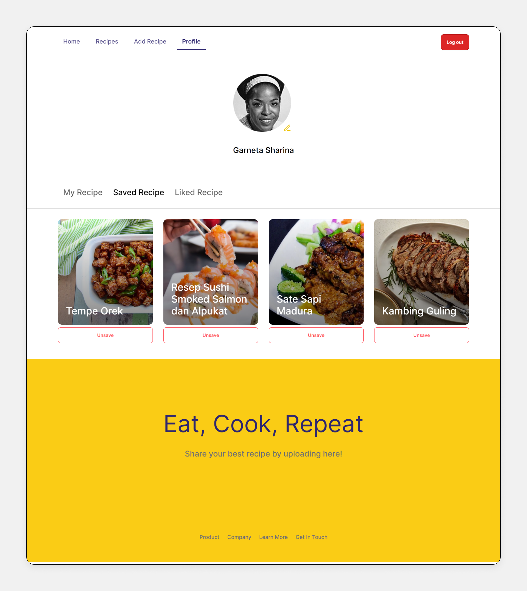
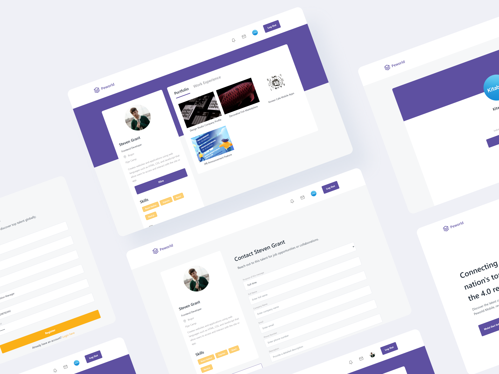
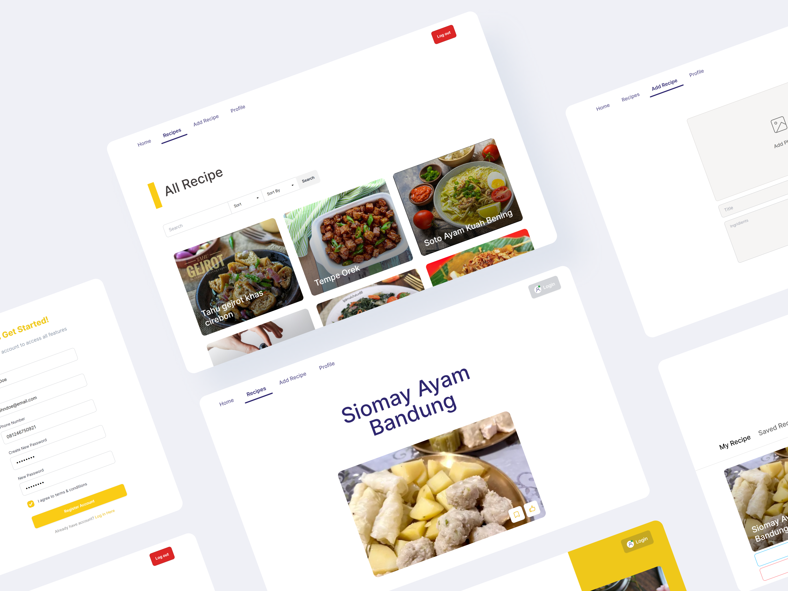

<a id="readme-top"></a>

<br />
<div align="center">
  <a href="https://github.com/naufandarmawan/mamarecipe-fe">
    
  </a>

  <h3 align="center">MamaRecipe</h3>
  <p align="center">
    Recipe Sharing Platform (Web Application) 
  </p>
</div>


<details>
  <summary>Table of Contents</summary>
  <ol>
    <li>
      <a href="#about-the-project">About The Project</a>
      <ul>
        <li><a href="#built-with">Built With</a></li>
        <li><a href="#features">Features</a></li>
        <li><a href="#screenshots">Screeshots</a></li>
      </ul>
    </li>
    <li>
      <a href="#getting-started">Getting Started</a>
      <ul>
        <li><a href="#prerequisites">Prerequisites</a></li>
        <li><a href="#installation">Installation</a></li>
        <li><a href="#development">Development</a></li>
        <li><a href="#production">Production</a></li>
      </ul>
    </li>
    <li><a href="#contributing">Contributing</a></li>
    <li><a href="#related-projects">Related Projects</a></li>
    <li><a href="#license">License</a></li>
    <li><a href="#contact">Contact</a></li>
  </ol>
</details>


## About The Project

Inspired by a 3,300% increase in Google searches for food menu inspiration in Indonesia over the past five years, MamaRecipe is a recipe-sharing platform that allows users to search, sort, and share recipes. This project aims to provide users with an accessible and interactive culinary resource.

<p align="right">(<a href="#readme-top">back to top</a>)</p>


### Built With

* Next.js
* DaisyUI
* Tailwind CSS
* Zustand
* Jest
* Vercel

<p align="right">(<a href="#readme-top">back to top</a>)</p>


### Features

* Account creation
* Search and view recipe details
* Like and save recipes
* Create, edit, and delete recipes,
* Edit user profiles.


<p align="right">(<a href="#readme-top">back to top</a>)</p>


### Screenshots

<table style="width: 100%; border-collapse: collapse;">
  <colgroup>
    <col style="width: 33.33%;">
    <col style="width: 33.33%;">
    <col style="width: 33.33%;">
  </colgroup>
  <tr>
    <th style="padding: 8px; text-align: center; border: 1px solid #ddd;">Landing Page</th>
    <th style="padding: 8px; text-align: center; border: 1px solid #ddd;">Login Page</th>
    <th style="padding: 8px; text-align: center; border: 1px solid #ddd;">Register Page</th>
  </tr>
  <tr>
    <td style="padding: 8px; text-align: left; border: 1px solid #ddd;">
      <div style="width: 100%; height: 300px; overflow: hidden;">
        
      </div>
    </td>
    <td style="padding: 8px; text-align: left; border: 1px solid #ddd;">
      <div style="width: 100%; height: 300px; overflow: hidden;">
        
      </div>
    </td>
    <td style="padding: 8px; text-align: left; border: 1px solid #ddd;">
      <div style="width: 100%; height: 300px; overflow: hidden;">
        
      </div>
    </td>
  </tr>
  <tr>
    <th style="padding: 8px; text-align: center; border: 1px solid #ddd;">Search Page</th>
    <th style="padding: 8px; text-align: center; border: 1px solid #ddd;">Add Recipe Page</th>
    <th style="padding: 8px; text-align: center; border: 1px solid #ddd;">Recipe Details Page</th>
  </tr>
  <tr>
    <td style="padding: 8px; text-align: left; border: 1px solid #ddd;">
      <div style="width: 100%; height: 300px; overflow: hidden;">
        
      </div>
    </td>
    <td style="padding: 8px; text-align: left; border: 1px solid #ddd;">
      <div style="width: 100%; height: 300px; overflow: hidden;">
        
      </div>
    </td>
    <td style="padding: 8px; text-align: left; border: 1px solid #ddd;">
      <div style="width: 100%; height: 300px; overflow: hidden;">
        
      </div>
    </td>
  </tr>
  <tr>
    <th style="padding: 8px; text-align: center; border: 1px solid #ddd;">Saved Recipe Page</th>
    <th style="padding: 8px; text-align: center; border: 1px solid #ddd;">Liked Recipe Page</th>
    <th style="padding: 8px; text-align: center; border: 1px solid #ddd;">Edit Recipe Page</th>
  </tr>
  <tr>
    <td style="padding: 8px; text-align: left; border: 1px solid #ddd;">
      <div style="width: 100%; height: 300px; overflow: hidden;">
        
      </div>
    </td>
    <td style="padding: 8px; text-align: left; border: 1px solid #ddd;">
      <div style="width: 100%; height: 300px; overflow: hidden;">
        
      </div>
    </td>
    <td style="padding: 8px; text-align: left; border: 1px solid #ddd;">
      <div style="width: 100%; height: 300px; overflow: hidden;">
        
      </div>
    </td>
  </tr>
  <!-- Repeat similar rows for more screenshots -->
</table>

<p align="right">(<a href="#readme-top">back to top</a>)</p>


## Getting Started

To set up and run the project locally, follow these steps:

### Prerequisites

Before starting, make sure you have npm installed. You can install it globally using:

* npm
  ```sh
  npm install npm@latest -g
  ```

### Installation

1. Clone the repository:
   ```sh
   git clone https://github.com/naufandarmawan/mamarecipe-fe.git
   ```
2. Navigate into the project directory:
   ```sh
   cd mamarecipe-fe
   ```
3. Install dependencies:
   ```sh
   npm install
   ```
4. Set up environment variables:
   * Create a `.env` file in the root directory of your project.
   * Add your API key to the `.env` file:
   ```js
   NEXT_PUBLIC_API = 'ENTER YOUR API';
   ```
   * Replace 'ENTER YOUR API KEY HERE' with your actual API key.

### Development

5. Start the development server:
   ```sh
   npm run dev
   ```

### Production

6. Build the project:
   ```sh
   npm run build
   ```
7. Start the production server:
   ```sh
   npm run start
   ```

By following these steps, you'll have everything set up to run the project locally on your machine.

<p align="right">(<a href="#readme-top">back to top</a>)</p>


## Contributing

Contributions are what make the open source community such an amazing place to learn, inspire, and create. Any contributions you make are **greatly appreciated**.

If you have a suggestion that would make this better, please fork the repo and create a pull request. You can also simply open an issue with the tag "enhancement".

Don't forget to give the project a star! Thanks again!

1. Fork the Project
2. Create your Feature Branch (`git checkout -b feature/AmazingFeature`)
3. Commit your Changes (`git commit -m 'Add some AmazingFeature'`)
4. Push to the Branch (`git push origin feature/AmazingFeature`)
5. Open a Pull Request

<p align="right">(<a href="#readme-top">back to top</a>)</p>


## Related Projects

Here are some related projects and resources you may find helpful. These include demo links, backend links, and other projects from my portfolio:

* MamaRecipe Demo: [MamaRecipe Demo](https://mamarecipe-fe-naufan.vercel.app/)
* MamaRecipe Backend: [MamaRecipe Backend](https://github.com/naufandarmawan/mamarecipe-be)

### My Other Portfolios

<table style="width: 100%; border-collapse: collapse;">
<colgroup>
    <col style="width: 33.33%;">
    <col style="width: 33.33%;">
    <col style="width: 33.33%;">
  </colgroup>
  <tr>
    <th style="padding: 8px; text-align: center; border: 1px solid #ddd;">Peworld Web App</th>
    <th style="padding: 8px; text-align: center; border: 1px solid #ddd;">Peworld Mobile App</th>
    <!-- <th style="padding: 8px; text-align: center; border: 1px solid #ddd;">MamaRecipe Web App</th> -->
    <th style="padding: 8px; text-align: center; border: 1px solid #ddd;">Blanja Web App</th>
  </tr>
  <tr>
    <td style="padding: 8px; text-align: left; border: 1px solid #ddd;"><a href="https://github.com/naufandarmawan/peworld-fe"></a></td>
    <td style="padding: 8px; text-align: left; border: 1px solid #ddd;"><a href="https://github.com/naufandarmawan/peworld-mobile"></a></td>
    <!-- <td style="padding: 8px; text-align: left; border: 1px solid #ddd;"><a href="https://github.com/naufandarmawan/mamarecipe-fe"></a></td> -->
    <td style="padding: 8px; text-align: left; border: 1px solid #ddd;"><a href="https://github.com/naufandarmawan/blanja-fe"></a></td>
  </tr>
  <!-- Repeat similar rows for more screenshots -->
</table>

<p align="right">(<a href="#readme-top">back to top</a>)</p>


## License

Distributed under the MIT License. See <a href="https://github.com/naufandarmawan/mamarecipe-fe/blob/main/LICENSE">`LICENSE`</a> for more information.

<p align="right">(<a href="#readme-top">back to top</a>)</p>


-----


<p align="center" id="contact">© MamaRecipe 2024</p>
<p align="center">
<a href="https://github.com/naufandarmawan/"> Naufan Darmawan </a> - <a href="mailto:naufandarmawan@gmail.com">naufandarmawan@gmail.com</a> - <a href="https://www.linkedin.com/in/naufandarmawan/">LinkedIn</a>
</p>
